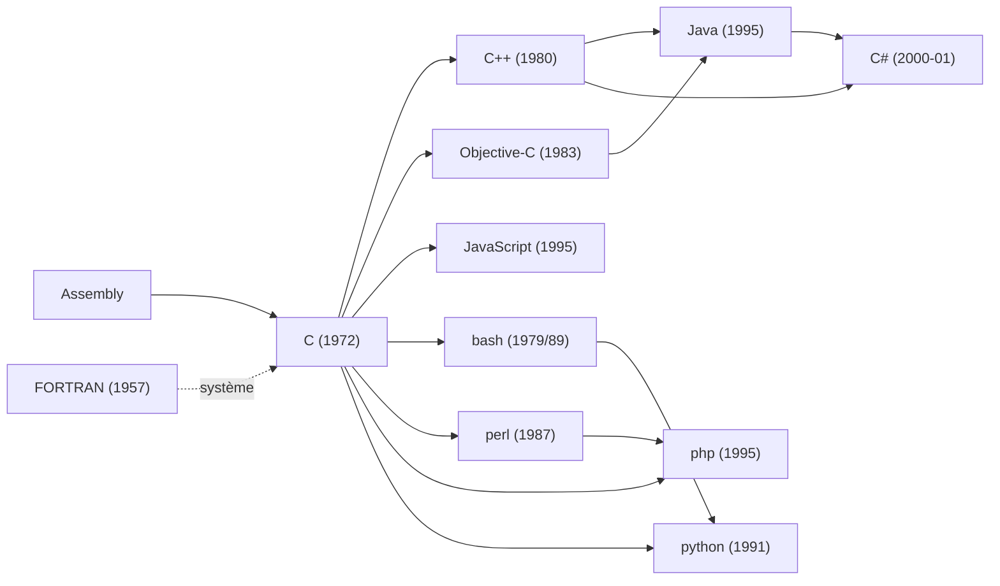

---
tags:
  - programmation
  - C
  - Cpp
  - histoire-info
  - revision
sources:
  - C Programming for Everybody 
  - "Coding for Everyone: C and C++ "
  -  Wikipedia
date: 2026-07-02
Auteur: Elouzi
---


---

## 🧠 La phrase mnémotechnique maîtresse

Pour retenir **l'ordre chronologique de la lignée principale** :

> **"F**ranck **A**dore **C**oder **C++**omme **O**bjectif **J**ava, **P**uis **C#**hoisit **J**avaScript"**

`F`ORTRAN → `A`ssembly → `C` → `C++` → `O`bjective-C → `J`ava → `P`HP → `C#` → `J`avaScript

(Elle ne respecte pas l'ordre exact des dates à 100%, mais elle relie les 9 langages piliers dans un seul ordre de "parenté" — répète-la 3 fois, elle reste.)

### Mnémotechnique pour le camp "scripting / interprété" (rouge sur le tableau)
> **"B**on **P**erl **P**arle **P**ython"** → **b**ash (79) → **p**erl (87) → **p**hp (95) → **p**ython (91)
(Astuce : ce sont les 4 langages "outils du couteau suisse Unix", tous des dérivés indirects de C, tous interprétés.)

---

## 🗺️ L'arbre visuel (comme sur ton tableau noir)



---

## 📅 Table chronologique complète (les deux tableaux fusionnés)

| Langage | Année | Créateur | Lieu | Pourquoi (le "besoin") |
|---|---|---|---|---|
| **Assembly** | ~1949 | (collectif, IBM/labs) | USA/UK | Parler directement au processeur, remplacer le binaire pur |
| **FORTRAN** | 1957 | John Backus | IBM, USA | Calcul scientifique (**Scien**ce **Calc**ulations — d'où le titre vert sur ton image) |
| **LISP** | 1958 (souvent 1960) | John McCarthy | MIT, USA | Intelligence artificielle, traitement symbolique |
| **ALGOL 60** | 1960 | Comité international | Europe/USA | Langage "algorithmique" universel, ancêtre théorique de C, Pascal, Java |
| **Simula 67** | 1967 | Dahl & Nygaard | Norvège | Premier langage à objets (classes, héritage) |
| **Pascal** | 1970 | Niklaus Wirth | ETH Zurich, Suisse | Enseigner la programmation structurée |
| **Smalltalk** | 1971-72 | Alan Kay | Xerox PARC, USA | Concrétiser le tout-objet + interface graphique |
| **C** | 1972 | Dennis Ritchie (avec Ken Thompson) | Bell Labs, USA | Réécrire **Unix** pour qu'il devienne portable |
| **Scheme** | 1975 | Sussman & Steele | MIT, USA | Simplifier LISP, sémantique minimaliste |
| **bash** | 1977 (sh) / 1989 (bash) | Stephen Bourne / Brian Fox | Bell Labs → GNU/FSF | Interface shell pour piloter Unix |
| **C++** | 1980 (publié 1985) | Bjarne Stroustrup | Bell Labs, USA | Ajouter les **classes** à C sans perdre la vitesse ("C with Classes") |
| **Objective-C** | 1983 | Brad Cox & Tom Love | USA | Fusionner Smalltalk (objets) + C (perf) → deviendra le langage NeXT/Apple |
| **Perl** | 1987 | Larry Wall | USA | Traitement de texte et rapports système Unix |
| **Python** | 1991 | Guido van Rossum | CWI, Pays-Bas | Lisibilité et simplicité, "pseudo-code exécutable" |
| **Java** | 1995 | James Gosling | Sun Microsystems, USA | "Write Once, Run Anywhere" pour objets connectés/TV interactive |
| **JavaScript** | 1995 | Brendan Eich | Netscape, USA | Rendre les pages web interactives (écrit en **10 jours !**) |
| **PHP** | 1995 | Rasmus Lerdorf | USA | Suivre les visites de sa page perso ("Personal Home Page") |
| **C#** | 2000-2001 | Anders Hejlsberg | Microsoft, USA | Concurrent direct de Java pour la plateforme .NET |

---

## 🔑 Mnémotechniques par famille

### 1. La famille "C-like syntaxe accolades { }"
> Note en rouge sur ton image : **"C uses curly braces {} for code blocks."**
> Astuce : tous les langages qui utilisent `{ }` (C, C++, Objective-C, Java, C#, JavaScript, PHP) sont des **enfants syntaxiques de C**. Python et bash, eux, utilisent l'indentation → ce sont les "rebelles" de la famille.

### 2. Retenir les dates à deux chiffres (technique du "âge du langage")
Astuce : imagine que chaque langage a un **âge** ; range-les comme une classe d'école, du plus vieux au plus jeune :
- FORTRAN (55) → le grand-père
- LISP (58-60) → le philosophe
- C (72) → le père de famille (celui qui a tout réécrit : **Unix**)
- Objective-C (83) → le cousin discret qui deviendra célèbre plus tard (Apple)
- C++ (80) → le grand frère sérieux
- Perl (87) → l'oncle bricoleur de scripts
- Python (91) → la sœur qui simplifie tout
- Java (95) / JavaScript (95) / PHP (95) → **les triplés de 1995** (facile à retenir : la même année, trois langages totalement différents naissent : un pour les objets connectés, un pour le web côté client, un pour le web côté serveur)
- C# (00-01) → le petit dernier, copie/amélioration de Java chez Microsoft

### 3. Mnémotechnique "3 frères de 95"
> **J**ava, **J**avaScript, p**H**p → **"J-J-H de 95"** (Gosling, Eich, Lerdorf — à ne jamais confondre : Java ≠ JavaScript, ils n'ont **aucun lien technique**, seulement un an de naissance et un nom marketing commun !)

### 4. Mnémotechnique "Bell Labs = la maternité"
> **C, C++, bash (sh), Unix** naissent tous au **même endroit : Bell Labs (AT&T), New Jersey, USA.**
> Phrase : *"Chez Bell, on a fait Naître Unix, Coder en C, puis Compter en C++."*

---

## 💡 Pourquoi le typage et le POO ont été inventés (Stroustrup)

- **Le typage est l'ami du compilateur.** Stroustrup répète souvent cette idée : un typage fort (comme en C/C++) permet au compilateur de détecter les erreurs *avant* l'exécution, d'optimiser le code, et de documenter l'intention du programmeur. C'est l'opposé du typage dynamique de Python, où les erreurs de type ne sont vues qu'à l'exécution.
  > Mnémotechnique : **"Le compilateur est un ami sévère : plus tu lui donnes de types, plus il te protège tôt."**

- **Le POO (OOP) a été ajouté à C pour réduire l'écriture.** Le but de Stroustrup en créant "C with Classes" (C++) n'était pas juste philosophique, c'était **pragmatique**. Regrouper données + fonctions dans une `class` évite de réécrire sans cesse les mêmes structures et les mêmes appels de fonctions dispersés. Une classe encapsule l'état et le comportement → moins de code répété, moins d'erreurs, plus de réutilisation.
  > Mnémotechnique : **"POO = Paresse Organisée et Optimisée"** (on organise le code pour écrire moins, pas plus).

- **C++ est le grand-père du `class` / `self` que tu retrouves en Python.** Quand tu écris en Python :
  ```python
  class Chaine:
      def __init__(self, texte):
          self.texte = texte
  ```
  Le `class`, la méthode liée à l'instance, et le paramètre `self` (équivalent du `this` implicite en C++) descendent **directement** de l'invention du POO sur C par Stroustrup en 1980. Python n'a fait qu'hériter et simplifier une idée déjà posée par C++ (elle-même héritée de Simula 67).
  > Fil de parenté : **Simula 67 (objets) → C++ (POO sur C, `this`) → Python (POO simplifié, `self`)**

---

## 🐧 Unix et les standards — le fil conducteur

- **1969** : Unix est créé par Ken Thompson et Dennis Ritchie chez **Bell Labs**, d'abord en Assembly.
- **1972** : Ritchie invente **C** précisément pour **réécrire Unix** et le rendre portable sur d'autres machines → c'est LE moment charnière de ton tableau ("System" écrit en vert entre Assembly/FORTRAN et C).
- **K&R C (1978)** : le livre de Kernighan & Ritchie devient la référence de facto.
- **ANSI C / C89 (1989)** puis **ISO C90, C99, C11, C17, C23** : les standards qui unifient les compilateurs.
- **Shell Unix (sh, 1977)** puis **bash (1989, projet GNU)** : l'interface en ligne de commande pour piloter le système — écrite elle-même en C.
- **POSIX (1988)** : la norme qui garantit qu'un programme C/Unix tourne pareil sur différents systèmes (Linux, BSD, macOS...).

> Mnémotechnique : **"Unix a accouché de C, C a accouché de tout le reste."**
> C'est la phrase à retenir pour comprendre pourquoi *C Programming for Everybody* (le cours 100% C) est le socle indispensable avant *Coding for Everyone: C and C++* (qui ajoute la couche objets).

---

## 🎓 Lien avec tes deux formations Coursera

| Formation | Ce qu'elle couvre dans l'arbre | Notion clé |
|---|---|---|
| [C Programming for Everybody](https://www.coursera.org/specializations/c-programming-for-everybody) | Le tronc : Assembly → **C** | Syntaxe procédurale, pointeurs, mémoire, gestion bas niveau, héritage direct d'Unix |
| [Coding for Everyone: C and C++](https://www.coursera.org/specializations/coding-for-everyone) | Le tronc **C → C++** | Ajout de la programmation orientée objet (classes, héritage) — le même saut historique que Stroustrup en 1980 |

Autrement dit : en suivant ces deux formations dans l'ordre, tu rejoues **exactement** l'histoire réelle du langage (1972 → 1980).

---

## 📝 Fiches flash (à réviser en Obsidian avec un plugin spaced repetition)

- Q: Qui a créé C et pourquoi ? → R: Dennis Ritchie, en 1972 à Bell Labs, pour réécrire Unix de façon portable.
- Q: Pourquoi Java et JavaScript n'ont rien à voir malgré leur nom ? → R: Java = James Gosling/Sun (1995, machine virtuelle, objets connectés) ; JavaScript = Brendan Eich/Netscape (1995, script web, rien à voir techniquement — coup marketing.
- Q: Quel langage a été écrit en seulement 10 jours ? → R: JavaScript, par Brendan Eich en 1995.
- Q: Quelle est la triple filiation de C++ ? → R: C (syntaxe/perf) + Simula 67 (objets) = "C with Classes" par Bjarne Stroustrup, 1980.
- Q: Quel standard garantit la portabilité entre systèmes Unix ? → R: POSIX (1988).
- Q: D'où vient Objective-C et qui l'a rendu célèbre ? → R: Créé par Brad Cox (1983), rendu célèbre par NeXT puis Apple (macOS/iOS).
- Q: Quel langage utilise l'indentation au lieu des accolades ? → R: Python (et bash dans une moindre mesure) — contrairement à toute la famille C.

---

*Sources : Wikipedia — History of programming languages ; K&R "The C Programming Language".
